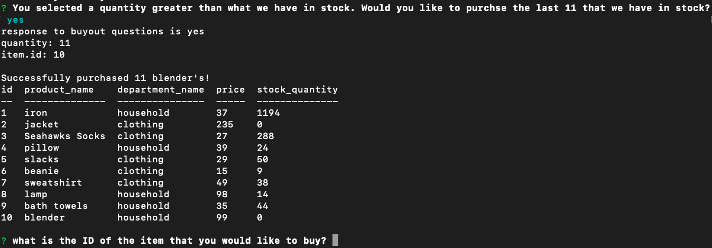

# storefront

This appliation is a CLI or Command Line Interface based application that accomplishes 3 main goals.  It allows a user to identify all of the items in a store on a single view, including cost, stock, and ID numbers; choose an item to purchase and revise the request based on existing stock if it is a limiting factor to the request; and update the inventory stored in data if the purchase can in fact be made.

First, the user, upon opening the application, with see a grid including all the products with the cost and inventory associated. A the same time, the user is prompted to choose the ID number of the product that the user would like to purchase.

Second, the user is prompted to input a quantity of the item that they would like to purchase.

Third, if the quantity is more than the current stock, the user will be prompted to respond that they would like to purchase the remaining stock and not the initially requested quantity.  If that's not the case or if the user responds in the affirmative to the aforementioned question, the purchase will complete and the user will be presented with an update of the new value of the stock quantity.

I hope that you enjoy this mock storefront experience.
